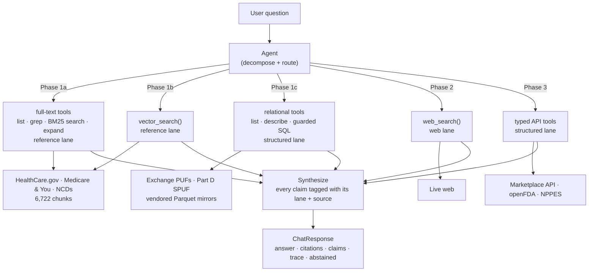
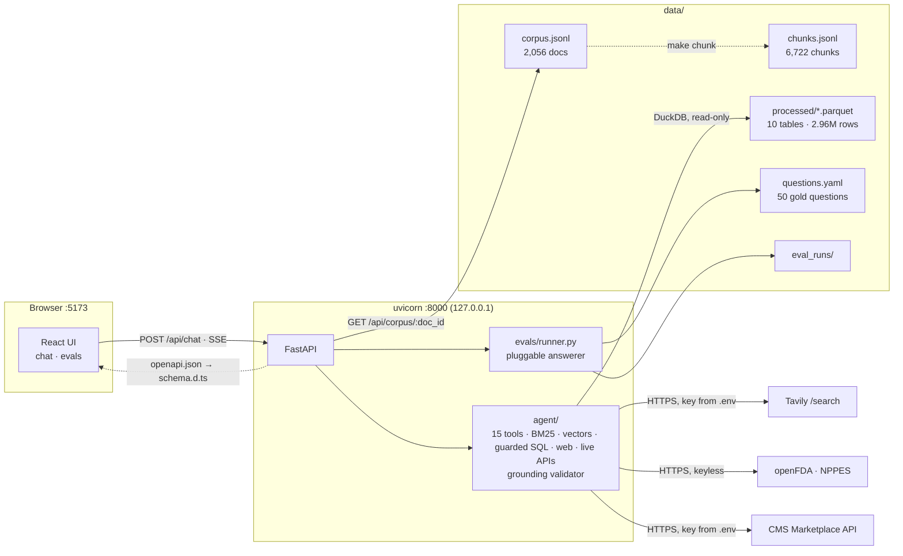
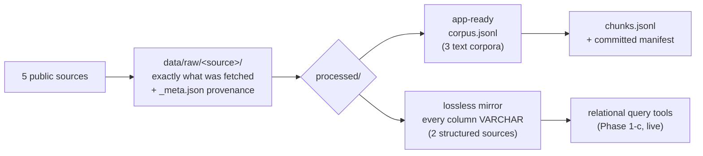
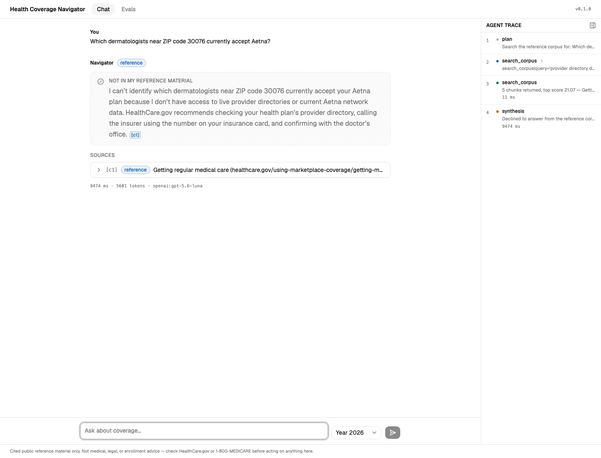
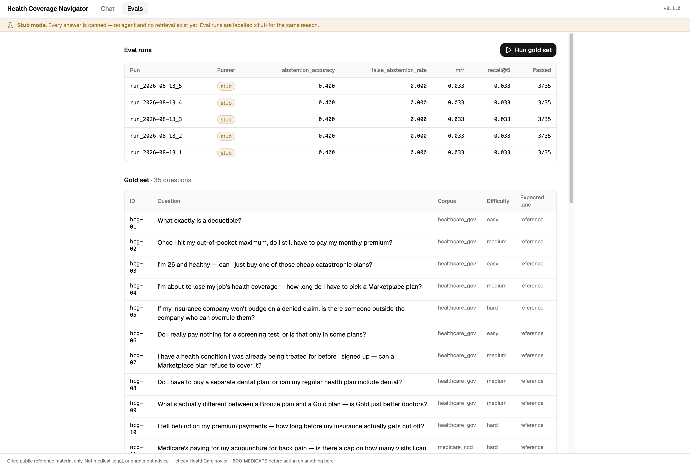

# Health Coverage Navigator

**An AI agent that answers U.S. health-insurance questions by routing each sub-question to the
right kind of source — indexed reference documents, deterministic public APIs, or the live web —
and shows you exactly what backs every claim.**

Built on public data only. Local-first. Eval-driven from the first commit.

---

## The engineering thesis

Most "chat with your documents" projects treat health coverage as a retrieval problem. It isn't.
Nearly every real question decomposes into sub-questions that need **fundamentally different
kinds of lookup**, and picking the wrong one produces an answer that is fluent, cited, and wrong.

| Sub-question type | Example | Lane | Why retrieval alone fails |
|---|---|---|---|
| *"What does the rule say?"* | What is a deductible? | **Reference** | — this is the one retrieval is for |
| *"What's the fact for this plan/drug/provider?"* | Is drug X covered under plan Y? | **Structured API** | The answer is a row in a database, not a passage. Retrieval will find a *plausible* passage. |
| *"What's happening now?"* | Any recent recall on drug X? | **Web search** | The corpus is a snapshot. It cannot know it is stale. |

So the core engineering problem is **tool routing**, and routing correctness is graded as its own
metric, separate from answer correctness. That framing drives everything else in the repo: the
API contract, the eval harness, and the phase order.

It also decides the shape of the build. This is **one agent that grows a toolset**, not a RAG app
that grows features: Phase 1 stands up a single PydanticAI agent over the reference corpus, and
every phase after it registers more tools on that same agent — vector search, then relational
queries over the vendored plan data, then web search, then typed API tools — rather than adding a
pipeline beside it. Nothing anywhere chains
retrieve → stuff-context → generate; the agent chooses its own tools, and choosing is the thing
being graded.

Full reasoning: [docs/plan.md](docs/plan.md).

---

## Technical highlights

**If you are here to read the engineering, start with
[docs/technical_highlights.md](docs/technical_highlights.md).** Seven mechanisms written up in full —
each stating the problem, the approach, the obvious alternative that was rejected, and the evidence
that it works:

| | |
|---|---|
| [Hallucinated citations are made structurally impossible, not discouraged](docs/highlights/grounded-citations.md) | The citable set is recorded by the tools; an output validator refuses anything outside it. Not a prompt instruction — a code path the model cannot talk its way past. Most necessary in the web lane, where an invented URL is plausible and checkable by nobody |
| [A test suite that *cannot* spend money — and the guard that had to be repaired](docs/highlights/offline-test-suite.md) | A safety flag borrowed from a library covers that library's surface area, not your intent. How the hole opened, how it was found, what closes it — and the phase that re-opened it exactly as the write-up predicted |
| ["Missing" and "wrong" are different failures, and get opposite treatment](docs/highlights/missing-vs-stale.md) | Degrade when the system is visibly reduced; refuse when it would be invisibly wrong. One rule, four resources, a different policy at each call site |
| [A model will call your tools wrongly — so every rejection is written as a correction](docs/highlights/tool-retries.md) | A bad regex or a wrong column name is a first draft, not an error. Every rejection says what broke, which value broke it, and **what to send instead** — and the failures a retry cannot fix degrade instead |
| [Letting a model write SQL — safely, successfully, and with every number citable](docs/highlights/model-written-sql.md) | Two independent guards on model-written SQL, the mechanisms that make the model's queries *succeed*, and a byte-exact citation for a table cell |
| [Three APIs, three ways of saying "nothing" — and why an empty result is an answer](docs/highlights/live-api-edge-cases.md) | *"No recalls on record"* arrives from the FDA as an HTTP **404**. Written the obvious way, a client calls that a failure and the agent abstains on a question it just answered. Three upstreams, three empty-result conventions, and the citable row every one of them has to leave behind |
| [The system prompt is composed per configuration, because a stale sentence is an instruction](docs/highlights/composed-prompt.md) | The agent ships in 48 shapes; one hardcoded prompt is wrong in 47. Measured here: a sentence left standing after the tool it described was replaced made the agent abstain without calling a single tool |

---

## Status — complete through Phase 3 of 5

> **Active development on this project is complete (2026-08-28).** Phases 0–3 shipped and are
> measured; Phases 4 and 5 were scoped and deliberately not built. What they were, and every
> smaller capability that was deferred with a stated reason — several with a named trigger
> condition — is collected in
> [docs/future_enhancements.md](docs/future_enhancements.md). Nothing below is a to-do list.

> **Where this actually is: three lanes, four sources, and the tri-modal core is complete.**
> Ask a health-coverage question in the browser and a PydanticAI agent searches the indexed
> reference corpus — by keyword *and* by meaning, choosing between the two itself — or, for a
> question about a **specific plan or drug**, writes SQL against the vendored CMS plan data and
> cites the **row** it read, cell by cell — or **calls a live API** and cites the record: the FDA's
> drug labelling and recall database, the national NPI registry, and HealthCare.gov's own plan
> prices and formularies — or, for something none of them can know, searches the open web and cites
> the page. It says *"not in my reference material"* when the question falls outside all four.
>
> **Phase 3's own metric is 7/7** — every live question reached the right tool — and the six new
> tools cost the reference slice nothing measurable. What is *not* built is **network** data: the
> NPI registry says what a provider *is*, never which plans pay them, so *"which dermatologists take
> Aetna"* is still correctly declined and is now dated to Phase 5 rather than this one.

The build order is deliberate. The eval harness was built before the agent so the agent had
something to be measured against on the day it arrived, and the API contract was frozen before
there was anything real behind it so later phases add *values* to existing fields instead of
reshaping the response. Phase 1a cost the contract two optional fields and the chat UI nothing;
Phase 1b cost it two more and the chat UI nothing again; **Phase 1c added a whole second lane and
cost the contract nothing at all** — a row citation is the existing `Citation` with `chunk_id`
left null. **Phase 2 added the third lane for one optional field**, and that field was not the web
lane's: `source_type: "web"` and the amber badge had been sitting in the contract unused since
Phase 0, so a web citation needed nothing new. The field it did cost (`TokenEvent.reset`) paid for
a *pre-existing* streaming bug the web lane happened to expose.

### What works today

| | |
|---|---|
| **The agent** | One PydanticAI agent, **fifteen** tools it composes itself across three lanes and four sources. Reference: `search_corpus` (stdlib BM25) / `vector_search` (LanceDB embeddings) / `grep_corpus` / `get_chunk` / `list_documents`. Relational: `list_tables` / `describe_table` / `query_structured`. Web: `web_search`. Live: `drug_label` / `drug_recalls` (openFDA), `lookup_provider` (NPPES), `find_drug` / `check_drug_coverage` / `find_plans` (CMS Marketplace). *What it may search* and *whether each later lane exists* are independent per-run flags, so every comparison is one code path measured two ways |
| **The relational lane** | DuckDB queries the vendored CMS plan mirrors **in place** — no load step, 53 ms to open and verify 10 tables, 3–16 ms a lookup. Model-written SQL is guarded twice: one `SELECT` only (statement-type checked before execution), on a connection sandboxed to `data/processed/` with external access off and configuration locked. Escape attempts are a test, not a claim |
| **The web lane** | `web_search` over Tavily, and the provenance problem it creates is the interesting part: a model can write a *plausible URL it never retrieved*, and unlike an invented chunk id nobody could tell by looking. So a web citation names a `result_id` only a search can assign. A rate limit or outage returns an `unavailable` result the model must report — never an empty list, so an outage cannot be served as "the web does not cover this" |
| **The live lane** | Three upstreams behind six typed tools, and the rule that shaped all of them: **an empty result is an answer.** openFDA says "nothing matched" with a 404 and NPPES with `result_count: 0` — so *"no recalls on record"* has to arrive as a confident finding, not an outage. The inverse of Phase 2's rule, and it needed the same care: a negative finding has to emit a **citable row**, because a true finding with nothing to cite forces a false abstention or a worse source — measured once as the agent holding CMS's own answer and citing a web page for it. Every such path emits one, and [a test enforces it](docs/negative-finding-gaps.md) rather than the next tool having to remember |
| **Live-API provenance** | A live record is cited as a **row** — same shape, same validator, same card as a vendored one, because it makes the same kind of claim. What it adds is a `url` the reader can open, which a mirror row cannot have. The CMS key rides in the query string, so it is **stripped before any citation URL is stored**, with a test whose failure would be a security finding — and stripping it means the surviving URL returns 401, so the Marketplace lane cites the **consumer page** and carries the exact query as a cell instead. **A citation that looks checkable and is not is worse than one that plainly is not**; a test over every Marketplace shape enforces the split |
| **Grounding** | Enforced in code, not asked for in the prompt. A passage or web citation must name evidence a tool returned and quote it verbatim; a **row** citation must name a row a query returned and reproduce its cells **byte for byte** — `'$4,500 '` keeps its trailing space, because tidying the evidence is editing it. Citations are rebuilt from the real chunk, row or result, so an invented title cannot reach the browser |
| **Abstention** | A first-class boolean, never inferred from the prose, rendered as a visually distinct panel |
| **Streaming** | The answer streams token by token *and* the tool trace fills in live, over SSE |
| **Ingestion** | 5 bulk sources fetched, normalized, and committed — idempotent and re-runnable |
| **Corpus** | 2,056 documents across 3 text corpora → **6,722 chunks** with verified provenance |
| **Structured mirrors** | Exchange PUFs (3 tables, PY2026) + Medicare Part D SPUF (7 files, 2026Q2) as lossless columnar mirrors — *deliberately not chunked*, and since Phase 1c queried where they lie: 2.96M rows the agent can read but nothing reshapes |
| **Eval harness** | 50 gold questions in **five** shapes (30 reference + 4 structured-mirror + **7 structured-live** + 4 web + 5 abstention), four runners (`agent` / `bm25` / `vector` / `stub`) through one scorer, retrieval + groundedness + **three-lane routing** + **mirror-vs-live lane detail** + **exact-cell** metrics, runs persisted as JSON and triggerable from the browser. Web questions deliberately carry **no expected answer** — a gold answer about what is true this month is wrong next month, and a set that rots silently is worse than one that admits its scope |
| **API** | FastAPI with a frozen contract: `POST /api/chat`, SSE streaming, eval endpoints, citation drill-down |
| **Frontend** | React 19 + Vite 8 + TS + Tailwind 4 + shadcn — chat page with source badges, expandable citation cards, collapsible agent-trace panel, abstention state, and an eval dashboard |
| **Type safety across the boundary** | TS types generated from FastAPI's OpenAPI schema — a Pydantic change becomes a compile error |
| **Guardrails** | `make scan` — a three-severity scanner for secrets, PII/PHI, and licence-restricted content, run before anything is published |
| **Configuration** | Secrets in a git-ignored `.env`; every non-secret in a **committed `config.yaml`** that no environment variable can override — so an eval score is reproducible from the repo |
| **Gates** | 476 Python tests + 27 Vitest, ruff, pyright, tsc, oxlint — one `make check-all`, which **never reaches a provider**: three separate guards, because a library's safety flag covers that library's surface area and not your intent. No API key needed and nothing to pay for |

### Measured, not asserted

All on the same chunk snapshots, through one scorer. **The gold set grew with the lanes** — 40
questions through Phase 1c, 43 at Phase 2, 50 since Phase 3 — so rows from different phases share a scorer but not
always a denominator, and the `measured` column says which phase produced each. The two
retrieval-only runners retrieve and stop, no model in the loop, so the gap between them and the
agent rows is what the agent's query reformulation is worth, and the gap between *them* is what the
embeddings are worth.

| runner | measured | recall@5 | MRR | abstention acc. | routing | exact cell | groundedness |
|---|---|---|---|---|---|---|---|
| `stub` — canned answers (Phase 0 baseline) | 1a | 0.033 | 0.033 | 0.400 | — | — | — |
| `bm25` — lexical retrieval only, no model | 1b | 0.567 | 0.416 | — | — | — | 1.000 |
| `vector` — semantic retrieval only, no model | 1b | **0.733** | **0.561** | — | — | — | 1.000 |
| `agent` — lexical tools only | 1b | 0.667 | 0.650 | 1.000 | — | — | 1.000 |
| `agent` — vector tool only | 1b | 0.733 | 0.717 | 1.000 | — | — | 1.000 |
| `agent` — both, reference lane only | 1c | 0.767 | 0.711 | 1.000 | — | — | 1.000 |
| `agent` — both + relational lane | 1c | 0.800 | 0.733 | 0.833 | 1.000 | 0.875 | 1.000 |
| `agent` — both + relational, web **off** (control) | 2 | 0.633 | 0.633 | **1.000** | 1.000 | 1.000 | 1.000 |
| `agent` — all three lanes, live APIs **off** (control) | 3 | 0.733 | 0.683 | 0.800 | **1.000** | 1.000 | 1.000 |
| **`agent` — three lanes, four sources (shipped)** | **3** | **0.700** | **0.642** | **0.800** | 0.977 | **1.000** | **1.000** |

Plus `web_reach_rate` **1.000** at Phase 2 and `lane_detail_correct` **1.000** at Phase 3 — the
latter is Phase 3's own metric, and the reason it had to exist: **both halves of the structured lane
carry the same `source_type`**, deliberately, because a live record makes the same kind of claim a
vendored row does. So `routing` cannot see the split the phase is about — mirror-vs-live — and a
second metric reads `tools_used` instead. It is 7/7 on the latest run (`run_2026-08-27_1`, 39/50):
every live question reached the right tool, including one asking for the FDA label of a drug that
does not exist.

**The bottom two rows are Phase 3's comparison**, and the pair above them is Phase 2's — each is two
runs differing *only* in whether one lane was registered.

**Phase 3's result: six more tools cost the reference slice nothing measurable.** The risk the phase
carried was tool-count inflation — nine tools became fifteen, where Phase 2's clean result came from
adding *one*. It did not materialise: seven questions changed state between the arms, three lost and
**two gained**, and **none of the losers touched a live tool**. Over-reach onto pre-existing
questions across all 43 was exactly one (`abs-02` called `find_drug`). recall@5 moved 0.733 → 0.700,
well inside the spread described below. Read that as **no evidence of harm**, not as "no harm" — the
distinction is the whole point of the caveat two paragraphs down.

Routing 0.977 rather than 1.000 is **two live questions on a 43-question denominator**, not a
reference-lane regression: reference routing never moved.

**Phase 2's comparison**: two runs differing *only* in whether the agent could see the web. The result that mattered is that **the third lane costs the first two nothing**
— 0.667 against 0.633 is one question against a known 0.200 spread — because the risk of adding a
lane is that the agent starts reaching for it on questions the corpus already answers. It did not:
`tools_used` (added this phase so the question could be answered from a run file at all) records
`web_search` on **0 of 30 reference questions and 4 of 4 web questions**. Routing is 1.000 across
three lanes, using the *same grader* Phase 1c wrote — what grew was the question set, not the code.

**Read the 1c and Phase 2 rows as separate experiments, not a trend.** The 1c row scored 0.800 and
the Phase 2 control — the *same configuration*, a different day — scored 0.633. That 0.167 gap is
model nondeterminism, sitting inside the documented 0.200 spread, and it is the clearest
illustration on this page of why any single agent row is a sample rather than a score. Each
comparison is only valid against its own control.

**The one regression is `abs-03`, and it is the most interesting result of the phase.** Asked *"what
will the standard Part B premium be in 2027?"* — a figure CMS has not published — the agent abstains
without the web lane and, with it, finds projections written *about* the figure and answers anyway.
Abstention accuracy 1.000 → 0.800 on a five-question slice. **This is not a routing error**: the web
was the right lane to try. And the grounding guardrail cannot catch it, because the answer *is*
grounded — the quoted words really are on the page. What is missing is any check that a source is
*authoritative for the claim*, which nothing here does yet; Phase 4's per-claim provenance is where
it belongs. The question was deliberately kept as an abstention to expose exactly this, and it did.

(The 1c row's 0.833 abstention was 5 of 6; the Phase 2 rows are out of 5, because `abs-04` —
*"was there a recall this week?"* — carried `becomes_answerable_at_phase: "2"` from the day it was
written and became a web question, which is the intended lifecycle of an abstention.)

Answer correctness (LLM judge, opt-in) was last measured at 0.739 under Phase 1a's judge model and
is a historical sample.

**Phase 1b's decision was taken on the two retrieval-only rows, not on the agent rows**, and that
is the methodological point rather than a shortcut. Those two have no model in them, so they
reproduce exactly — the `vector` row came back identical to three decimals across two runs — while
the agent rows carry the spread described next. Vector beats lexical 0.733 to 0.567, and the two
**fail differently**: vector fixes 7 questions and regresses 2, with four of the fixes landing at
rank 1. That complementarity is why "both" ships, and it clears the bar the plan set — *"both has
to earn its place: it only wins if it beats each alone."*

**The agent rows are single runs, and the spread is wide.** Seven runs at effectively one configuration put
recall@5 anywhere between **0.600 and 0.867** — model nondeterminism alone, on a 30-question
in-corpus set where one question is worth 0.033. So treat any difference under about 0.100 as noise
— **including 0.800 vs 0.767, and 0.667 vs 0.633, above.** The two retrieval-only rows have no such
caveat: no model is in the loop, so they return the same number every time, which is exactly why the
lexical-vs-vector call was made there.

**One caveat here was itself a bug, found in Phase 2 and worth stating because it cuts the wrong
way.** An errored question used to drop its expected lane, which meant it left the recall
denominator instead of counting as the miss it was — so a run that *lost* questions scored
**higher**. Phase 2's first eval reported 0.741 over 27 questions where the honest number was 0.667
over 30. Fixed, with a regression test, and the table above is the recomputed version. Any recall
figure quoted anywhere in this repo from a run with `ERR` rows reads high.

**Rate limits are the main obstacle to measuring this thing, and Phase 1c made it worse.** A
structured question costs ~40k tokens — `list_tables`, then `describe_table`, then SQL, with the
whole conversation resent each turn — against a 200k/minute account ceiling. Three sweeps were
thrown away before the pair above completed: at three questions in flight ten errored, at five,
twenty-five and thirty-three did, one of them reporting `recall@5 0.033` for a set that was never
answered. **Run the agent evals sequentially**, and read a run with errored questions as broken
rather than weak. The errors are in the run record for exactly that reason.

Groundedness and citation resolution are deterministic and should always read 1.000 — the output
validator rejects anything else before an answer is built. They are measured anyway, because a
guardrail nobody checks is one that has already stopped working. Answer correctness is an LLM judge
scoring each answer against the gold set's key facts, run on a *different* model from the one it
grades, behind an opt-in `make eval-judge`. The 0.739 above was graded by the judge model in use at
the time; that setting has since changed, so the number is a historical sample, not a figure the
current `config.yaml` reproduces.

### What does not work yet

This list is the honest boundary of the shipped system, and it stays as written now that the build
has stopped — an item that quietly stopped being true would be the worst failure a public README can
have. Most of these are deliberate boundaries rather than gaps, and each is carried forward with its
reasoning in [docs/future_enhancements.md](docs/future_enhancements.md).

- **There is no network data, and that is a design boundary rather than a gap to fill.** The NPI
  registry says what a provider *is* — identity, specialty, status — never which plans pay them.
  So *"which dermatologists near 30076 take Aetna"* is still declined; it needs the Marketplace's
  provider-coverage endpoint, which is **Phase 5**, where plan.md puts network checks. That
  question was mis-dated to Phase 3 in the gold set for two phases and is now corrected.
- **Live-API answers are graded on routing and groundedness, not correctness.** Seven live gold
  questions carry no expected answer, for the same reason the web questions do not: a formulary, a
  premium and a recall list all move underneath a stable question. Correctness for those is asserted
  in offline fixture tests, where the response is pinned. So this repo measures that the agent
  *reaches* the right source and quotes it honestly — **not that its live answers are good.**
- **A negative finding in the *mirror* half is still not citable.** The live lane's version of this
  is closed — nine paths, one helper, and a test that walks every tool — but
  `query_structured` returning zero rows is in the same bind: "empty is an answer" with no way to
  cite that answer. Left open deliberately rather than swept in, because it is Phase 1-c code whose
  change should be measured against the mirror slice.
  The live half, and how a rule that was fixed four times finally became an invariant:
  [negative-finding-gaps.md](docs/negative-finding-gaps.md).
- **The web lane can be fooled about authority.** `abs-03` above is the demonstration: finding
  writing *about* an unpublished figure is not the same as the figure existing, and neither the
  grounding guardrail nor the routing metric catches it — the answer is grounded and the lane is
  right. There is no notion anywhere yet of a source being authoritative *for a given claim*.
- **The web lane cannot read further into a page.** Tavily returns three reranked chunks per
  result; when the answer sits just outside them the only recovery is a narrower query. `read_url`
  over Tavily's `/extract` — this lane's `get_chunk` — is deferred with a named trigger condition
  rather than built on the anticipation.
- **Four web gold questions, graded on routing only.** They carry no expected answer by design (a
  pinned answer about this month is wrong next month), so this repo measures that the agent *goes*
  to the web and quotes it honestly — **not whether its web answers are any good.** That is the
  honest boundary of what a static gold set can assert about a live source.
- **Name → identifier translation is live, but only on the Marketplace side.** `find_drug` resolves
  a drug name to RxCUIs and `check_drug_coverage` takes them, so *"is atorvastatin covered under
  plan Y"* is answerable today. The **vendored** Part D formulary still carries NDC and RxCUI and no
  drug names, so the same question against a mirror partition still needs an identifier.
- **Retrieval is still the bottleneck of the reference lane.** recall@5 0.700 in the shipped
  configuration means the agent never saw the right document for about 3 of 10 in-corpus questions. Six of the thirty defeat *both*
  retrieval methods, so the remaining gap is not one more index — it is chunking, the gold set's
  phrasing, or query reformulation.
- **Four mirror, seven live and four web gold questions is thin.** Every one is unambiguous by
  construction, so a routing score near 1.000 is the first number to distrust as they grow — and the
  live slice is thinner than it looks, since two of its six questions were **reworded after they
  failed**. Both rewordings are argued in the questions' notes (one tested state coverage through a
  pricing tool; one required a four-hop chain that Phase 4 owns), but changing a test after watching
  it fail deserves a reader's scepticism.
- **No plan comparison.** The relational lane answers about *one* plan at a time; comparing plans,
  breaking a cost down, and checking a pharmacy network are Phase 5, and the row cap is sized for
  lookups accordingly.
- **No hybrid ranking.** LanceDB carries BM25 in the same table and it is deliberately unused:
  "both" means both *tools*, with the agent reconciling them, which is the thing being measured.
- **No planning or decomposition.** The agent calls tools in a loop but does not break a compound
  question into sub-questions and route each one — that is Phase 4, along with per-claim provenance.
- **Single-turn only.** `conversation_id` is carried in the contract but nothing uses it yet.

---

## Architecture

### The target system



***Nothing is dashed any more.* All three lanes are live and the structured lane has both halves** —
the agent chooses between prose, vendored rows, live records and the open web. Each phase
label is a set of tools added to the same agent; the box marked `Agent` is never rebuilt after Phase
1a. Note that 1a and 1b both point at the reference lane — they are two ways of searching one
corpus, and 1b's vector tool joins the lexical ones rather than replacing them. 1c and 3 both feed
the structured lane the same way: 1c reads rows out of the vendored mirrors, 3 adds rows fetched
live, and they share one `source_type`. "Decompose" is Phase 4; today the agent routes and loops but
does not split a question up.*

### What runs today



Vite proxies `/api` to uvicorn in development, so the browser only ever sees one origin —
**no CORS configuration anywhere**. In single-process mode FastAPI serves the built bundle itself.

### Ingestion



`processed/` deliberately means two different things, and the difference is load-bearing: a
structured source is **never** chunked or embedded. See [data/README.md](data/README.md).

---

## Screenshots

All real output from the live agent — no fixtures, no mock-ups.

### Chat — a real answer, and everything behind it

![The chat page: the agent's answer to "what exactly is a deductible?" with a reference source badge, inline [c1] markers, an expanded citation card showing the retrieved chunk, and the agent trace panel open on the right showing plan, search_corpus call, search_corpus result and synthesis](docs/img/chat-page.png)

The **agent trace** on the right is a user-facing feature from the first agent phase, not a debug
view: it shows the tool the agent chose, the query it wrote — note that it reformulated *"what
exactly is a deductible?"* into search terms rather than pasting the question — and how long each
step took. That legibility is the reason the agent gets four narrow tools instead of one
`retrieve()` call.

Everything else the contract carries is rendered too: the **source badge** (`reference` — blue;
`structured_api` green since Phase 1-c and `web` amber since Phase 2), inline `[c1]` markers that scroll to their
card, and an **expandable citation card** with the retrieved chunk verbatim, a link to the source,
and a drill-down into the full corpus document. The plan-year selector sits beside the input and is
sent on every request, per the domain's most common correctness bug.

### Chat — the web lane, and what makes a web citation trustworthy


Asked something no vendored document can know, the agent routes to `web_search` — and the trace
shows it doing so twice: a broad `topic="news"` search over the last month, then a **narrower
reformulation** scoped to `site:cdc.gov`. Reformulation is the only recovery this lane has, because
there is deliberately no tool to read further into a page.

The two details that matter for provenance are both visible. Each trace step is summarised by the
**domains it reached** (*"4 result(s) from cdc.gov, who.int"*) rather than by a result count, because
*where* the agent went is the interesting part of a web step. And each citation card is titled with
its **domain and publication date** — `… — cdc.gov, Wed, 12 Aug 2026` — built from the retrieved
result, never from the model. In this domain who published a claim is part of the claim, and a card
that showed only a title would hide a forum post behind the same chrome as a CDC page. The date is
there because the agent searched with `topic="news"`, which is the only way Tavily returns one; an
undated page about a deadline is weak evidence, and the model is told to say so.

The answer is also a good illustration of the grounding rule under a *negative* result: it says
*"I found no indication in the recent sources I checked"* rather than "there is no outbreak", and it
declines to let an E. coli and Salmonella investigation stand in for a virus. Both citations quote
their page verbatim — the output validator would have rejected them otherwise.

### Chat — the live lane, and two upstreams in one answer


One question, **two live upstreams, three tools**. The trace shows the chain: `find_drug` turns the
word *"atorvastatin"* into RxCUIs (*"10 match(es), e.g. atorvastatin 80 MG Oral …"*),
`drug_label` asks openFDA for that drug's `indications` section, and `check_drug_coverage` takes
one of the RxCUIs (`259255`) against the plan id and the year, coming back
*"1 drug/plan pair(s): Covered"*. **Name → identifier translation is the hop that makes this lane
usable at all**, and the trace makes it legible: each step shows the arguments the model wrote,
so the RxCUI moving from one tool's result into the next tool's call is visible rather than implied.

The badge is the **same green `structured_api`** a vendored row gets — deliberately, because a live
record makes the same kind of claim a mirror row does. That is exactly why Phase 3 needed its own
metric: `routing` cannot see the mirror-vs-live split, so a second one reads `tools_used`.

The citations are the same shape too: a **row**, cell by cell, through the same validator and the
same card. What a live row adds is the `Open source` link under each — the openFDA query itself, or
the Marketplace lookup — which a mirror row cannot have, and which is the difference between
citing a record and citing a database. The CMS key rides in that query string, so it is stripped
before any citation URL is stored; the test that checks it is one whose failure would be a security
finding.

### Abstention — the answer that is worth the most



Asked which dermatologists near a ZIP code take a given insurer, it declines — and says why, and
points at what would know. `abstained` is a first-class boolean in the API, never pattern-matched
out of the prose, so this panel cannot be one prompt tweak away from silently disappearing.

### Evals — four runners, one scorer, honestly labelled



*Screenshot captured at Phase 1a — the numbers in it predate the vector runner and the toolset
badge, and the table above this section is the current one.*

The `agent`, `bm25`, `vector` and `stub` runs sit in one table because they go through one scorer,
so their numbers are directly comparable — that is what makes "the agent beats raw retrieval 0.800
to 0.567" a measurement rather than a claim. Only `agent` gets the green badge; the others are
amber, because none of them is a real answer. Agent runs also carry a **toolset** badge, since
Phase 1b's whole comparison is between runs that differ only in that. The metric columns are derived from the data rather than
hardcoded, so groundedness and answer correctness appeared this phase without the table changing,
and `—` marks a metric a run does not report. Below sits the per-question breakdown, and below that
the gold set with the `expected lane` column the routing metric is scored against — three lanes
since Phase 2.

---

## Quickstart

Requires [`uv`](https://docs.astral.sh/uv/) and **Node 22** (pinned in `.nvmrc`; the `ui-*` make
targets load nvm automatically if it is installed).

```bash
uv sync                 # Python deps into .venv
make ui-install         # frontend deps (needs node >= 22.12)
make chunk              # build chunks.jsonl — git-ignored, ~1s, required by the agent
make puf                # download the plan-data mirrors — git-ignored, ~24 MB, required too
cp .env.example .env    # then add OPENAI_API_KEY; TAVILY_API_KEY for the web lane,
                        # CMS_MARKETPLACE_API_KEY for live plan prices (both optional)
make dev                # both servers → open http://127.0.0.1:5173
```

The text corpus is committed, so there is nothing to download for it — but `chunks.jsonl` is not,
the Parquet plan mirrors are not, and the keys are yours. Skip any of them and the app still boots,
reports that lane unconfigured on `/api/health`, and returns a 503 naming the fix rather than
quietly answering worse — `make chunk`, `make puf`, or `.env` respectively. (To run without a lane
at all, set `agent.structured_tools: false`, `agent.web_tools: false` or `agent.live_tools: false`.)

**The live lane degrades in pieces rather than all at once**, which is the one asymmetry worth
knowing: openFDA and the NPI registry need no credential, so they work on a fresh clone. Only the
three Marketplace tools go unregistered without `CMS_MARKETPLACE_API_KEY` — and the agent is *told*
it cannot price plans rather than the app refusing to start, because two thirds of a lane still
working is not the same failure as none of it.

Try *"what exactly is a deductible?"* for the reference lane, *"what is the individual medical
deductible on marketplace plan 38344AK1060002 for 2026?"* for the relational one — it answers with
six rows, one per cost-sharing variant, because that plan has six — and something out of reach like
*"which dermatologists near 30076 take Aetna?"* to see it abstain. For the web lane, ask something
the corpus cannot know — *"what is the deadline to enroll in a 2027 Marketplace plan?"* — and watch
the trace show `web_search` and the domains it reached. For the live lane, try *"has atorvastatin
been recalled?"* — the FDA holds 44 — or *"what is Lipitor approved to treat?"*, and note the
citation card links to the openFDA query itself.

Everything else:

```bash
make eval-retrieval     # score BM25 retrieval alone — free, instant, no API key
make eval               # run the gold set through the agent (50 model calls; run it sequentially)
make eval-no-web        # the same with the web lane off — the control for what the lane costs
make eval-judge         # + grade answer correctness with an LLM judge (86 model calls)
make smoke-web          # one live question that only the web can answer (1 model call + 1 credit)
make eval-no-live       # the control for what the six live tools cost the other lanes
make check-all          # ruff · pyright · pytest · tsc · oxlint · vitest — never calls a model
make types              # regenerate frontend/src/api/schema.d.ts from OpenAPI
make scan               # secrets / PII / licensing scan — run before publishing
make help               # everything
```

`make check-all` runs green on a fresh clone: the frontend gate *skips with a message* when
`frontend/node_modules` is absent rather than failing.

---

## Engineering decisions worth defending

Each of these is written up in full in `docs/`, including the alternatives that were rejected. The
four with the most to say for themselves have their own pages under
[docs/highlights/](docs/highlights/) — see [Technical highlights](#technical-highlights) above.

**1. The eval harness was built before the agent, and the answerer is a parameter.**
At Phase 0 that parameter was the chat stub, so metrics were *genuinely computed against canned
answers* rather than faked. Phase 1a swapped in the agent and the API, the storage format and the
dashboard were untouched — and it also added a third answerer that retrieves and stops, so
"the agent is worth 0.567 → 0.800" is one scorer's output rather than two incomparable numbers.
A harness written after the agent tends to be written to make the agent look good.

**1b. The grounding guardrail is code, not a sentence in the prompt.**
([full write-up](docs/highlights/grounded-citations.md))
Every chunk a tool returns is recorded; an output validator rejects a citation of anything else, a
quotation not verbatim in its chunk, or a marker pointing at nothing — and tells the model why so
it can retry. Citations are then rebuilt from the real chunk, so the model contributes only *which*
passage and *which words*, both checked. The prompt deliberately does not restate any of it:
whatever a guardrail can enforce, the guardrail enforces. Measured groundedness is 1.000, which is
the only value it should ever have.

**2. `abstained` is a first-class boolean, not a phrase in the answer text.**
The grounding guardrail requires the agent to say *"not in my reference material"* rather than
hallucinate. If the frontend had to regex the answer to detect that, the guardrail would be one
prompt tweak away from breaking silently — in a health tool. So it is a field, and the UI renders
it as a distinct state. Same reasoning made the answer *structured* from day one
(`citations`, `claims`, `trace`, `source_type`) even in a phase with only one lane.

**3. The Pydantic ↔ TypeScript boundary is codegen, not discipline.**
`make types` dumps FastAPI's OpenAPI schema and generates `frontend/src/api/schema.d.ts`. Change
a model, and TypeScript errors on every component that no longer matches. TypeScript is pinned to
`~5.9` against the 6.x that `create-vite` now scaffolds, because `openapi-typescript` peer-requires
5.x — trading the enforcement mechanism for a major version nothing needs is the wrong trade.
The one seam codegen *can't* see (`client.ts` hand-writes its URL strings, so a renamed route
compiles clean and 404s at runtime) is why the [`sync-frontend`](.claude/skills/sync-frontend/SKILL.md)
skill exists.

**4. The licensing guardrail lives in code, with three severities.**
CPT and CDT procedure codes are AMA/ADA-copyrighted, so Medicare LCDs and Billing Articles are
blocked from this public repo while NCDs (which carry no procedure codes) are fine.
`scripts/scan_sensitive.py` enforces that alongside secrets and PII — **blocking** markers exit
non-zero, **advisory** ones compare against a recorded baseline so a *jump* is reported rather
than a nonzero, and **allowlisted** ones are suppressed but still counted. The advisory tier is
not a softer blocking tier; it exists because this corpus genuinely mentions CPT narratively in
revision histories, and a check that fails on legitimate mentions gets switched off within a week.
Licensing markers are scoped to `data/**` specifically so that **prose about the guardrail does
not trip the guardrail**.

The NCD fetcher makes the rule self-enforcing rather than policed: the MCD Coverage API's auth
boundary falls exactly on the licensing boundary — National endpoints answer without a key, LCD
and Article endpoints return `401` — so "NCDs only" becomes *the set of endpoints that respond
at all*.

**5. Chunk overlap is 320 characters because the longest gold snippet is 279.**
Not a round number picked by feel. Combined with snapping each chunk's start *backward only*,
realized overlap is always ≥ 320, so any passage shorter than that is wholly contained in at
least one chunk. That turns `test_gold_snippets_survive_chunking` from an observation into a
guarantee. "Snap to the nearest boundary" is the obvious-looking version of that code and quietly
breaks it — the splitter says so in a docstring.

**6. The Part D SPUF is fetched by HTTP range request.**
The published container is 2.49 GB of nested zips; the seven files this project needs total
9.4 MB. So the downloader reads the zip central directory over HTTP and pulls only the members it
wants — a 250× reduction in transfer cost on every refresh, which is the difference between a
pipeline that gets re-run and one that gets abandoned. What makes it trustworthy is the CRC32 in
the central directory: every member is verified before being written, so a mis-offset range fails
loudly instead of landing as plausible garbage.

**7. Structured sources land as a lossless mirror, not a model.**
([what Phase 1-c then did with it](docs/highlights/model-written-sql.md))
Every column of the Exchange PUFs is stored as `VARCHAR`, byte-for-byte. Every "numeric" column
there is publisher-formatted text (`'$450 '`, `'70.88%'`, `'Not Applicable'` sitting beside an
empty field — and those two mean *different* things), and Plan Attributes carries **36
max-out-of-pocket columns**. Choosing which one is "the" MOOP needs real query requirements, which
arrive in Phase 1-c when the agent starts querying this data. Guessing once at ingestion time is
worse than not guessing.

---

## Built with Claude Code — the process, not just the output

This repo is also an experiment in **engineering the AI workflow itself**. The interesting part is
not that an LLM wrote code; it's the scaffolding that makes an LLM's output reviewable, consistent
across sessions, and safe to publish.

**Four documents, four jobs, no overlap.** The most common failure mode of AI-assisted work is
context that rots — a status line in a conventions file, design decisions buried in a changelog.
So the split is enforced:

| Doc | Answers | Never contains |
|---|---|---|
| [`docs/plan.md`](docs/plan.md) | *What to build, and when* | Completion status, frontend specifics |
| [`docs/frontend_plan.md`](docs/frontend_plan.md) | *How the web UI works* | Phase scheduling |
| [`docs/progress.md`](docs/progress.md) | *What is actually built* | Design rationale for unbuilt things |
| [`docs/glossary.md`](docs/glossary.md) | *What the words mean* | Schedule, design, or status |
| [`docs/future_enhancements.md`](docs/future_enhancements.md) | *What was scoped and not built, and why* | Status, or a design it only links to |

The fifth row arrived with the wind-down, and it earns its place for the same reason as the other
four: without it, "not built" would have to live either in the plan (where it reads as scheduled) or
in the progress log (where it reads as a defect list). It collects and links; it never restates a
design.

**[`CLAUDE.md`](CLAUDE.md) holds only invariants** — the conventions that are true regardless of
how far along the build is, and *only* the ones worth spending context on in every session.
Rationale and detail live in `docs/` behind links (`development.md`, `configuration.md`, the
per-source guides), so the always-loaded file stays short. Guardrails stay legible because a
status change never shows up in the diff as a rules change.

**The progress log records dead ends, not just wins.** Every session appends *Did / Decided /
Rejected / Dead end / Stopped at*. A few of the entries that paid for themselves later:

- A test that monkeypatched a module constant but still wrote into the real `data/` tree, because
  default arguments bind at definition time. Caught by *listing the directory afterwards*, not by
  a failing assertion.
- `pyright` reported 0 errors for weeks while real type bugs sat in `tests/` — its `include` only
  covered `src`. A silent blind spot in the command the repo trusts is worse than a caught bug.
- 803 HealthCare.gov records collapsing to 747 distinct ids, because a Spanish content object
  self-reported an English URL. Deduping in the chunker would have silently stamped Spanish titles
  onto 21 English pages.

### Five custom skills, and the bar for writing one

A [skill](.claude/skills/) is a Markdown procedure the assistant loads **on demand** — when a
request matches its description, or on an explicit `/name` — so it costs no context until the
moment it applies. That makes the interesting question *what deserves to be one*, and the bar here
is deliberately high: **a procedure that is only commands belongs in the `Makefile`**, which is
where `make scan` and `make types` already live. A skill earns its place when the commands are the
easy half and the hard half is a **judgment call** — the decision an assistant would otherwise make
plausibly, wrongly, differently every session, and with no record of why.

| Skill | What it does | Use it when |
|---|---|---|
| [`scan-sensitive`](.claude/skills/scan-sensitive/SKILL.md) | Runs the pre-publish scanner, then **triages every hit** — a real leak, a regex bug, or genuinely publishable — and resolves each one rather than listing it | Before committing or pushing · after vendoring anything under `data/` · *"did I just leak something?"* |
| [`sync-frontend`](.claude/skills/sync-frontend/SKILL.md) | Propagates an API-contract change through codegen, follows the compiler, then checks **the seams the compiler cannot see** | After changing a Pydantic model under `api/`, or adding or renaming a route |
| [`upgrade-deps`](.claude/skills/upgrade-deps/SKILL.md) | A dependency bump end to end: prove the gates were green *before* touching anything, upgrade, bisect the breakage, bump the floors, write the PR description | *"update the dependencies"* · a single package bump · *"what's outdated?"* |
| [`wrap-up`](.claude/skills/wrap-up/SKILL.md) | Closes a session — appends the *Did / Decided / Rejected / Dead end / Stopped at* entry to `progress.md`, rewrites the current-state block, and sweeps the README | At the end of a working session, before the context is lost |
| [`walkthrough`](.claude/skills/walkthrough/SKILL.md) | Hands a change set over one step at a time — purpose, then the three-to-ten lines that carry the idea, then what to read in what order — and **stops** | Reviewing AI-written code you have not read yet |

**What each one actually encodes** is the rule that would otherwise be re-derived under pressure:

- **`scan-sensitive`: the order of operations after a leak.** Deleting the line fixes nothing — the
  value is already in history and possibly in someone's clone, so it is *rotate at the provider
  first*, then remove, then purge. And a false positive is a **pattern bug to fix, not a finding to
  allowlist**: an allowlist entry silences this instance while leaving the bad pattern free to bury
  the next true positive of the same shape. It also forbids printing a secret value while reporting
  one — a scanner that reprints secrets into a shareable transcript is a leak amplifier.
- **`sync-frontend`: the failure codegen cannot catch.** `make types` is one line and needs no
  skill. The content is the table of things that stay green and break at runtime — above all that
  `client.ts` hand-writes its URL strings, so a **renamed route compiles clean and 404s in the
  browser**. It also says where to *stop*: a new field that could be displayed gets reported and
  asked about, never rendered, because the UI tracks the phases rather than leading them.
- **`upgrade-deps`: a permission line, and a floor under the gates.** Tests, fixtures and lint churn
  it fixes on its own; anything under `src/` that changes runtime behaviour it must stop and ask
  about. And it may **never reach a green gate by weakening one** — no `# noqa`, no `skip`, no
  widened `Any`. Pinning a package back with a comment naming what blocks it is a legitimate
  outcome; a silenced gate is not.
- **`wrap-up`: never overstate, and never write what git already knows.** Counts and eval numbers
  are read out of the artifacts, not out of the conversation; *What does not work yet* is treated as
  the load-bearing list, because an item that quietly stops being true is the worst failure a public
  README can have.
- **`walkthrough`: the pause is the whole point.** One step per turn, ending the turn every time —
  the rule an agent erodes first, because two steps always look adjacent. A follow-up question is
  not permission to advance, and neither is silence. It also refuses to invent a rationale for code
  it cannot account for: *"I can see what this does but not why"* is the honest answer.

These are not hypothetical rules. `scan-sensitive` carries its two worked false positives because
both really happened — a bare `sk-` pattern matching inside the URL slug
`ask-about-preventive-services`, and an NPI detector firing on any Luhn-valid 10-digit run, which
reported digits inside a UUID. Both were fixed in the pattern and pinned with anti-canaries so they
cannot regress, and the skill teaches that fix rather than the workaround.

**A standing rule the assistant must obey: keep the glossary current.** Any change introducing a
domain term adds its entry in the *same* change — and an entry must say what the term means *in
this repo* (licensing status, routing lane, schema field, correctness rule), not just expand the
acronym.

---

## Repository map

```
health_coverage_navigator/
├── CLAUDE.md                     # invariants the assistant must obey
├── .claude/skills/               # 5 on-demand procedures the assistant loads by name
├── Makefile                      # every gate and workflow — `make help`
├── config.yaml                   # ⭐ every non-secret tunable — committed, never env-overridable
├── .env.example                  # secrets template; the real .env is git-ignored
├── src/health_coverage_navigator/
│   ├── agent/                    # ⭐ the agent: bm25 · index · tools · structured_tools · web_tools · live_tools · prompt · runtime
│   ├── structured/               # ⭐ the relational lane: catalog · store (DuckDB + the SQL guard)
│   ├── web/                      # ⭐ the web lane: client (Tavily + hygiene + degradation) · models
│   ├── live/                     # ⭐ the live half of the structured lane: openfda · nppes · marketplace · _http
│   ├── api/
│   │   ├── models.py             # ⭐ the frozen HTTP contract
│   │   ├── app.py                # app factory, static mount, SPA fallback
│   │   ├── routes/               # health · chat · evals · corpus
│   │   └── stub.py               # Phase 0 canned answers, kept as an eval baseline
│   ├── chunking/                 # splitter · per-source strategies · pipeline
│   ├── evals/                    # gold set · runner · answerers · graders · judge · structured_gold
│   └── config.py, settings.py, corpus.py, paths.py
├── frontend/src/
│   ├── api/{client,stream,schema.d.ts}   # schema.d.ts is GENERATED
│   ├── hooks/useChat.ts
│   ├── routes/{ChatPage,EvalsPage}.tsx
│   └── components/               # SourceBadge · CitationCard · TracePanel · …
├── scripts/                      # 5 downloaders + scan_sensitive.py
├── evals/gold/questions.yaml     # 50 hand-authored questions in five shapes
├── data/{raw,processed}/         # committed — see the licensing rules
└── docs/                         # plan · frontend_plan · progress · glossary · future_enhancements
                                  #   + agent · chunking · development · configuration
                                  #   + technical_highlights.md → highlights/*.md  ⭐
                                  #   + per-source data guides
```

---

## Data sources & licensing

Everything here is public data, and the boundary is enforced rather than assumed.

**Vendored** (bulk, committed): HealthCare.gov consumer content (explicitly licensed for reuse) ·
Medicare & You and 82 other CMS publications (public domain) · Medicare Coverage Database
**NCDs only** · Health Insurance Exchange PUFs · Medicare Part D SPUF.

**Live only, never vendored**: NPPES NPI Registry and openFDA. Both publish bulk downloads; both
are per-record lookups, so a 4 GB mirror would buy staleness and storage in exchange for nothing.
The consequence is worth stating: **no provider-level data is ever vendored into this repo.**

**Blocked**: Medicare LCDs and Billing/Coding Articles (they embed AMA/ADA-copyrighted CPT/CDT
codes) · any proprietary code table · any PII, PHI, secret, or API key.

Details in [docs/plan.md](docs/plan.md), enforcement in
[`scripts/scan_sensitive.py`](scripts/scan_sensitive.py), definitions in
[docs/glossary.md](docs/glossary.md).

---

## Roadmap

| Phase | Backend | Frontend | Status |
|---|---|---|---|
| **0** | Corpus + eval scaffold | Contract frozen, UI on a stub | ✅ **Complete** |
| **1a** | The agent + a full-text toolset (no database) | Stub → real agent, streaming | ✅ **Complete** |
| **1b** | `vector_search` (LanceDB) added alongside the lexical tools | Eval run-comparison view | ✅ **Done** |
| **1c** | Relational tools over the vendored PUF mirrors — DuckDB querying Parquet in place | `structured_api` badge, row-shaped citations | ✅ **Done** |
| **2** | `web_search` over Tavily + three-lane routing eval | `web` badge, routing accuracy | ✅ **Done** |
| **3** | Typed API tools (Marketplace, openFDA, NPPES) | `structured_api` badge, live-API citation links | ✅ **Done** |
| **4** | Multi-step loop, per-claim provenance, tracing | Nested trace, claim highlighting | 📋 **Scoped, not built** |
| **5** | Plan comparison, drug costs, network checks, "what changed" monitor — built on the Phase 1-c tools | Tables + monitor view | 📋 **Scoped, not built** |

**The build stopped at the end of Phase 3, deliberately and with the core complete.** Phases 4 and
5 have acceptance tests and capability checklists in [docs/plan.md](docs/plan.md) and were never
started; they are carried forward, alongside every smaller deferral, in
[docs/future_enhancements.md](docs/future_enhancements.md).

Routing went tri-modal at Phase 2; **the tri-modal core completed at Phase 3**, when the structured
lane gained its live half. Everything after is additive. Each phase
pairs new capability with a new **eval slice** — retrieval quality → answer correctness and
groundedness → structured-lookup correctness and lane routing → routing across all three lanes →
multi-hop correctness and citation accuracy → regression.

---

## Disclaimer

This is a personal engineering project. It is **not** medical, legal, insurance, or enrollment
advice. It presents cited public reference material and nothing more. Verify anything that
matters with the official source or a licensed professional.
