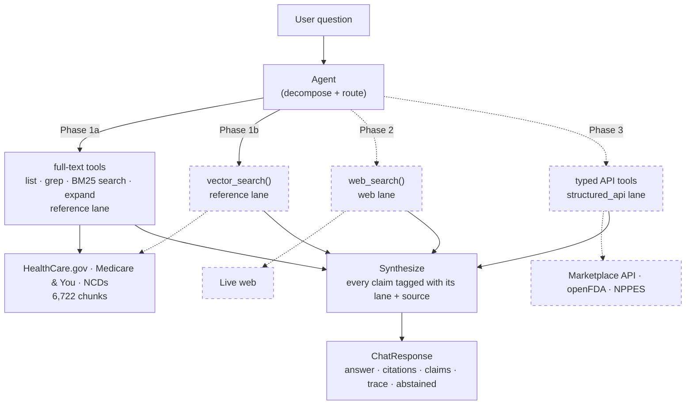
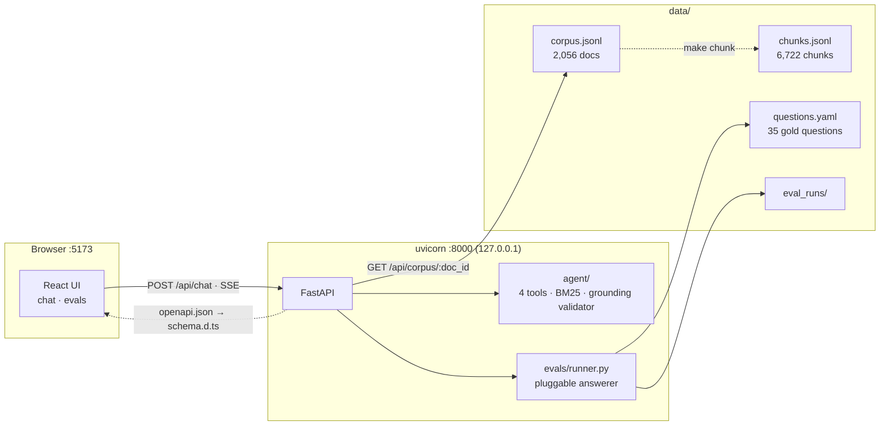
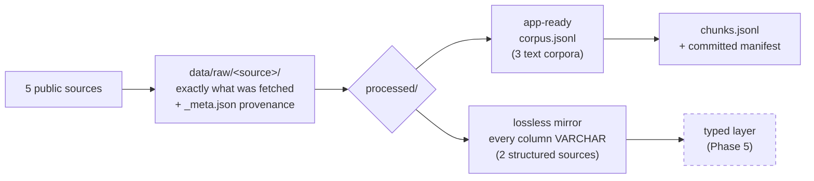

# Health Coverage Navigator

**An AI agent that answers U.S. health-insurance questions by routing each sub-question to the
right kind of source — indexed reference documents, deterministic public APIs, or the live web —
and shows you exactly what backs every claim.**

Built on public data only. Local-first. Eval-driven from the first commit.

---

## The engineering thesis

Most "chat with your documents" projects treat health coverage as a retrieval problem. It isn't.
Nearly every real question decomposes into sub-questions that need **fundamentally different
kinds of lookup**, and picking the wrong one produces an answer that is fluent, cited, and wrong.

| Sub-question type | Example | Lane | Why retrieval alone fails |
|---|---|---|---|
| *"What does the rule say?"* | What is a deductible? | **Reference** | — this is the one retrieval is for |
| *"What's the fact for this plan/drug/provider?"* | Is drug X covered under plan Y? | **Structured API** | The answer is a row in a database, not a passage. Retrieval will find a *plausible* passage. |
| *"What's happening now?"* | Any recent recall on drug X? | **Web search** | The corpus is a snapshot. It cannot know it is stale. |

So the core engineering problem is **tool routing**, and routing correctness is graded as its own
metric, separate from answer correctness. That framing drives everything else in the repo: the
API contract, the eval harness, and the phase order.

It also decides the shape of the build. This is **one agent that grows a toolset**, not a RAG app
that grows features: Phase 1 stands up a single PydanticAI agent over the reference corpus, and
every phase after it registers more tools on that same agent — vector search, then web search,
then typed API tools — rather than adding a pipeline beside it. Nothing anywhere chains
retrieve → stuff-context → generate; the agent chooses its own tools, and choosing is the thing
being graded.

Full reasoning: [docs/plan.md](docs/plan.md).

---

## Status — Phase 1b of 5 complete

> **Where this actually is:** the agent is live on **one lane of three**. Ask a health-coverage
> question in the browser and a PydanticAI agent searches the indexed reference corpus — by keyword
> *and* by meaning, choosing between the two itself — answers with citations back to specific
> chunks, and says *"not in my reference material"* when the question falls outside it. There is no web search and there are no
> live API tools yet — those are Phases 2 and 3, and the routing problem this project is about is
> not solved until they land.

The build order is deliberate. The eval harness was built before the agent so the agent had
something to be measured against on the day it arrived, and the API contract was frozen before
there was anything real behind it so later phases add *values* to existing fields instead of
reshaping the response. Phase 1a cost the contract two optional fields and the chat UI nothing; Phase 1b cost it two
more and the chat UI nothing again.

### What works today

| | |
|---|---|
| **The agent** | One PydanticAI agent, five tools it composes itself — `search_corpus` (stdlib BM25) / `vector_search` (LanceDB embeddings) / `grep_corpus` / `get_chunk` / `list_documents`. Which retrieval tools it sees is a per-run flag, so lexical-only, vector-only and both are one code path measured three ways |
| **Grounding** | Enforced in code, not asked for in the prompt: a citation of a chunk no tool returned, or a quotation not verbatim in its chunk, is rejected and retried. Citations are rebuilt from the real chunk, so an invented title cannot reach the browser |
| **Abstention** | A first-class boolean, never inferred from the prose, rendered as a visually distinct panel |
| **Streaming** | The answer streams token by token *and* the tool trace fills in live, over SSE |
| **Ingestion** | 5 bulk sources fetched, normalized, and committed — idempotent and re-runnable |
| **Corpus** | 2,056 documents across 3 text corpora → **6,722 chunks** with verified provenance |
| **Structured mirrors** | Exchange PUFs (3 tables, PY2026) + Medicare Part D SPUF (7 files, 2026Q2) as lossless columnar mirrors — *deliberately not chunked* |
| **Eval harness** | 35 gold questions (30 in-corpus + 5 abstention), three runners (`agent` / `bm25` / `stub`) through one scorer, retrieval + groundedness + answer-correctness metrics, runs persisted as JSON and triggerable from the browser |
| **API** | FastAPI with a frozen contract: `POST /api/chat`, SSE streaming, eval endpoints, citation drill-down |
| **Frontend** | React 19 + Vite 8 + TS + Tailwind 4 + shadcn — chat page with source badges, expandable citation cards, collapsible agent-trace panel, abstention state, and an eval dashboard |
| **Type safety across the boundary** | TS types generated from FastAPI's OpenAPI schema — a Pydantic change becomes a compile error |
| **Guardrails** | `make scan` — a three-severity scanner for secrets, PII/PHI, and licence-restricted content, run before anything is published |
| **Configuration** | Secrets in a git-ignored `.env`; every non-secret in a **committed `config.yaml`** that no environment variable can override — so an eval score is reproducible from the repo |
| **Gates** | 202 Python tests + 15 Vitest, ruff, pyright, tsc, oxlint — one `make check-all`, which **never calls a model**: no API key needed and nothing to pay for |

### Measured, not asserted

All on the same gold set and the same chunk snapshots. The two retrieval-only runners retrieve and
stop — no model in the loop — so the gap between them and the agent rows is what the agent's query
reformulation is worth, and the gap between *them* is what the embeddings are worth.

| runner | recall@5 | MRR | abstention acc. | groundedness | answer correctness |
|---|---|---|---|---|---|
| `stub` — canned answers (Phase 0 baseline) | 0.033 | 0.033 | 0.400 | — | — |
| `bm25` — lexical retrieval only, no model | 0.567 | 0.416 | — | 1.000 | — |
| `vector` — semantic retrieval only, no model | 0.733 | 0.561 | — | 1.000 | — |
| `agent` — lexical tools only | 0.667 | 0.650 | 1.000 | 1.000 | — |
| `agent` — vector tool only | 0.733 | 0.717 | 1.000 | 1.000 | — |
| **`agent` — both (shipped)** | **0.800** | **0.733** | **1.000** | **1.000** | 0.739 † |

† Answer correctness was last measured under Phase 1a's judge model and is a historical sample.

**Phase 1b's decision was taken on the two retrieval-only rows, not on the agent rows**, and that
is the methodological point rather than a shortcut. Those two have no model in them, so they
reproduce exactly — the `vector` row came back identical to three decimals across two runs — while
the agent rows carry the spread described next. Vector beats lexical 0.733 to 0.567, and the two
**fail differently**: vector fixes 7 questions and regresses 2, with four of the fixes landing at
rank 1. That complementarity is why "both" ships, and it clears the bar the plan set — *"both has
to earn its place: it only wins if it beats each alone."*

**The agent rows are single runs, and the spread is wide.** Seven runs at effectively one configuration put
recall@5 anywhere between **0.600 and 0.867** — model nondeterminism alone, on a 30-question
in-corpus set where one question is worth 0.033. So treat any difference under about 0.100 as noise
— **including 0.800 vs 0.733 above.** The two retrieval-only rows have no such caveat: no model is
in the loop, so they return the same number every time, which is exactly why the lexical-vs-vector
call was made there. Abstention accuracy reads 1.000 in every
run that completed without errored questions; the runs that dipped were runs that lost questions to
provider rate limits, which is a broken run rather than a weaker guardrail.

Groundedness and citation resolution are deterministic and should always read 1.000 — the output
validator rejects anything else before an answer is built. They are measured anyway, because a
guardrail nobody checks is one that has already stopped working. Answer correctness is an LLM judge
scoring each answer against the gold set's key facts, run on a *different* model from the one it
grades, behind an opt-in `make eval-judge`. The 0.739 above was graded by the judge model in use at
the time; that setting has since changed, so the number is a historical sample, not a figure the
current `config.yaml` reproduces.

### What does not work yet

- **Only one lane of three.** No web search (Phase 2) and no live API tools — Marketplace, openFDA,
  NPPES (Phase 3). Ask about a specific plan, premium, provider or formulary and it will correctly
  tell you it cannot answer. **The tri-modal routing this project is about is not built yet.**
- **Retrieval is still the bottleneck, though less of one.** recall@5 0.800 means the agent never
  saw the right document for about 2 of 10 in-corpus questions. Six of the thirty defeat *both*
  retrieval methods, so the remaining gap is not one more index — it is chunking, the gold set's
  phrasing, or query reformulation.
- **No hybrid ranking.** LanceDB carries BM25 in the same table and it is deliberately unused:
  "both" means both *tools*, with the agent reconciling them, which is the thing being measured.
- **No planning or decomposition.** The agent calls tools in a loop but does not break a compound
  question into sub-questions and route each one — that is Phase 4, along with per-claim provenance.
- **Single-turn only.** `conversation_id` is carried in the contract but nothing uses it yet.

---

## Architecture

### The target system



*Dashed = not built yet. The agent and its reference lane are live; the other three tool sets are
not, so **routing between lanes — the problem this project is about — has nothing to route between
yet.** Each phase label is a set of tools added to the same agent; the box marked `Agent` is never
rebuilt after Phase 1a. Note that 1a and 1b both point at the reference lane — they are two ways of
searching one corpus, and 1b's vector tool joins the lexical ones rather than replacing them.
"Decompose" is Phase 4; today the agent routes and loops but does not split a question up.*

### What runs today



Vite proxies `/api` to uvicorn in development, so the browser only ever sees one origin —
**no CORS configuration anywhere**. In single-process mode FastAPI serves the built bundle itself.

### Ingestion



`processed/` deliberately means two different things, and the difference is load-bearing: a
structured source is **never** chunked or embedded. See [data/README.md](data/README.md).

---

## Screenshots

All real output from the live agent — no fixtures, no mock-ups.

### Chat — a real answer, and everything behind it

![The chat page: the agent's answer to "what exactly is a deductible?" with a reference source badge, inline [c1] markers, an expanded citation card showing the retrieved chunk, and the agent trace panel open on the right showing plan, search_corpus call, search_corpus result and synthesis](docs/img/chat-page.png)

The **agent trace** on the right is a user-facing feature from the first agent phase, not a debug
view: it shows the tool the agent chose, the query it wrote — note that it reformulated *"what
exactly is a deductible?"* into search terms rather than pasting the question — and how long each
step took. That legibility is the reason the agent gets four narrow tools instead of one
`retrieve()` call.

Everything else the contract carries is rendered too: the **source badge** (`reference` — blue;
green and amber arrive with Phases 2 and 3), inline `[c1]` markers that scroll to their card, and
an **expandable citation card** with the retrieved chunk verbatim, a link to the source, and a
drill-down into the full corpus document. The plan-year selector sits beside the input and is sent
on every request, per the domain's most common correctness bug.

### Abstention — the answer that is worth the most


Asked which dermatologists near a ZIP code take a given insurer, it declines — and says why, and
points at what would know. `abstained` is a first-class boolean in the API, never pattern-matched
out of the prose, so this panel cannot be one prompt tweak away from silently disappearing.

### Evals — four runners, one scorer, honestly labelled


*Screenshot captured at Phase 1a — the numbers in it predate the vector runner and the toolset
badge, and the table above this section is the current one.*

The `agent`, `bm25`, `vector` and `stub` runs sit in one table because they go through one scorer,
so their numbers are directly comparable — that is what makes "the agent beats raw retrieval 0.800
to 0.567" a measurement rather than a claim. Only `agent` gets the green badge; the others are
amber, because none of them is a real answer. Agent runs also carry a **toolset** badge, since
Phase 1b's whole comparison is between runs that differ only in that. The metric columns are derived from the data rather than
hardcoded, so groundedness and answer correctness appeared this phase without the table changing,
and `—` marks a metric a run does not report. Below sits the per-question breakdown, and below that
the gold set with the `expected lane` column Phase 2's routing metric will be scored against.

---

## Quickstart

Requires [`uv`](https://docs.astral.sh/uv/) and **Node 22** (pinned in `.nvmrc`; the `ui-*` make
targets load nvm automatically if it is installed).

```bash
uv sync                 # Python deps into .venv
make ui-install         # frontend deps (needs node >= 22.12)
make chunk              # build chunks.jsonl — git-ignored, ~1s, required by the agent
cp .env.example .env    # then add your OPENAI_API_KEY
make dev                # both servers → open http://127.0.0.1:5173
```

The corpus is committed, so there is nothing to download — but `chunks.jsonl` is not, so
`make chunk` is required. Skip it and the app boots, reports the reference lane unconfigured, and
returns a 503 naming the fix rather than quietly answering worse.

Try *"what exactly is a deductible?"*, *"does Medicare cover acupuncture for chronic low back
pain?"*, and something out of corpus like *"which dermatologists near 30076 take Aetna?"* to see it
abstain.

Everything else:

```bash
make eval-retrieval     # score BM25 retrieval alone — free, instant, no API key
make eval               # run the gold set through the agent (35 model calls)
make eval-judge         # + grade answer correctness with an LLM judge (70 model calls)
make check-all          # ruff · pyright · pytest · tsc · oxlint · vitest — never calls a model
make types              # regenerate frontend/src/api/schema.d.ts from OpenAPI
make scan               # secrets / PII / licensing scan — run before publishing
make help               # everything
```

`make check-all` runs green on a fresh clone: the frontend gate *skips with a message* when
`frontend/node_modules` is absent rather than failing.

---

## Engineering decisions worth defending

Each of these is written up in full in `docs/`, including the alternatives that were rejected.

**1. The eval harness was built before the agent, and the answerer is a parameter.**
At Phase 0 that parameter was the chat stub, so metrics were *genuinely computed against canned
answers* rather than faked. Phase 1a swapped in the agent and the API, the storage format and the
dashboard were untouched — and it also added a third answerer that retrieves and stops, so
"the agent is worth 0.567 → 0.800" is one scorer's output rather than two incomparable numbers.
A harness written after the agent tends to be written to make the agent look good.

**1b. The grounding guardrail is code, not a sentence in the prompt.**
Every chunk a tool returns is recorded; an output validator rejects a citation of anything else, a
quotation not verbatim in its chunk, or a marker pointing at nothing — and tells the model why so
it can retry. Citations are then rebuilt from the real chunk, so the model contributes only *which*
passage and *which words*, both checked. The prompt deliberately does not restate any of it:
whatever a guardrail can enforce, the guardrail enforces. Measured groundedness is 1.000, which is
the only value it should ever have.

**2. `abstained` is a first-class boolean, not a phrase in the answer text.**
The grounding guardrail requires the agent to say *"not in my reference material"* rather than
hallucinate. If the frontend had to regex the answer to detect that, the guardrail would be one
prompt tweak away from breaking silently — in a health tool. So it is a field, and the UI renders
it as a distinct state. Same reasoning made the answer *structured* from day one
(`citations`, `claims`, `trace`, `source_type`) even in a phase with only one lane.

**3. The Pydantic ↔ TypeScript boundary is codegen, not discipline.**
`make types` dumps FastAPI's OpenAPI schema and generates `frontend/src/api/schema.d.ts`. Change
a model, and TypeScript errors on every component that no longer matches. TypeScript is pinned to
`~5.9` against the 6.x that `create-vite` now scaffolds, because `openapi-typescript` peer-requires
5.x — trading the enforcement mechanism for a major version nothing needs is the wrong trade.
The one seam codegen *can't* see (`client.ts` hand-writes its URL strings, so a renamed route
compiles clean and 404s at runtime) is why the [`sync-frontend`](.claude/skills/sync-frontend/SKILL.md)
skill exists.

**4. The licensing guardrail lives in code, with three severities.**
CPT and CDT procedure codes are AMA/ADA-copyrighted, so Medicare LCDs and Billing Articles are
blocked from this public repo while NCDs (which carry no procedure codes) are fine.
`scripts/scan_sensitive.py` enforces that alongside secrets and PII — **blocking** markers exit
non-zero, **advisory** ones compare against a recorded baseline so a *jump* is reported rather
than a nonzero, and **allowlisted** ones are suppressed but still counted. The advisory tier is
not a softer blocking tier; it exists because this corpus genuinely mentions CPT narratively in
revision histories, and a check that fails on legitimate mentions gets switched off within a week.
Licensing markers are scoped to `data/**` specifically so that **prose about the guardrail does
not trip the guardrail**.

The NCD fetcher makes the rule self-enforcing rather than policed: the MCD Coverage API's auth
boundary falls exactly on the licensing boundary — National endpoints answer without a key, LCD
and Article endpoints return `401` — so "NCDs only" becomes *the set of endpoints that respond
at all*.

**5. Chunk overlap is 320 characters because the longest gold snippet is 279.**
Not a round number picked by feel. Combined with snapping each chunk's start *backward only*,
realized overlap is always ≥ 320, so any passage shorter than that is wholly contained in at
least one chunk. That turns `test_gold_snippets_survive_chunking` from an observation into a
guarantee. "Snap to the nearest boundary" is the obvious-looking version of that code and quietly
breaks it — the splitter says so in a docstring.

**6. The Part D SPUF is fetched by HTTP range request.**
The published container is 2.49 GB of nested zips; the seven files this project needs total
9.4 MB. So the downloader reads the zip central directory over HTTP and pulls only the members it
wants — a 250× reduction in transfer cost on every refresh, which is the difference between a
pipeline that gets re-run and one that gets abandoned. What makes it trustworthy is the CRC32 in
the central directory: every member is verified before being written, so a mis-offset range fails
loudly instead of landing as plausible garbage.

**7. Structured sources land as a lossless mirror, not a model.**
Every column of the Exchange PUFs is stored as `VARCHAR`, byte-for-byte. Every "numeric" column
there is publisher-formatted text (`'$450 '`, `'70.88%'`, `'Not Applicable'` sitting beside an
empty field — and those two mean *different* things), and Plan Attributes carries **36
max-out-of-pocket columns**. Choosing which one is "the" MOOP needs real query requirements from
Phase 5. Guessing once at ingestion time is worse than not guessing.

---

## Built with Claude Code — the process, not just the output

This repo is also an experiment in **engineering the AI workflow itself**. The interesting part is
not that an LLM wrote code; it's the scaffolding that makes an LLM's output reviewable, consistent
across sessions, and safe to publish.

**Four documents, four jobs, no overlap.** The most common failure mode of AI-assisted work is
context that rots — a status line in a conventions file, design decisions buried in a changelog.
So the split is enforced:

| Doc | Answers | Never contains |
|---|---|---|
| [`docs/plan.md`](docs/plan.md) | *What to build, and when* | Completion status, frontend specifics |
| [`docs/frontend_plan.md`](docs/frontend_plan.md) | *How the web UI works* | Phase scheduling |
| [`docs/progress.md`](docs/progress.md) | *What is actually built* | Design rationale for unbuilt things |
| [`docs/glossary.md`](docs/glossary.md) | *What the words mean* | Schedule, design, or status |

**[`CLAUDE.md`](CLAUDE.md) holds only invariants** — the conventions that are true regardless of
how far along the build is, and *only* the ones worth spending context on in every session.
Rationale and detail live in `docs/` behind links (`development.md`, `configuration.md`, the
per-source guides), so the always-loaded file stays short. Guardrails stay legible because a
status change never shows up in the diff as a rules change.

**The progress log records dead ends, not just wins.** Every session appends *Did / Decided /
Rejected / Dead end / Stopped at*. A few of the entries that paid for themselves later:

- A test that monkeypatched a module constant but still wrote into the real `data/` tree, because
  default arguments bind at definition time. Caught by *listing the directory afterwards*, not by
  a failing assertion.
- `pyright` reported 0 errors for weeks while real type bugs sat in `tests/` — its `include` only
  covered `src`. A silent blind spot in the command the repo trusts is worse than a caught bug.
- 803 HealthCare.gov records collapsing to 747 distinct ids, because a Spanish content object
  self-reported an English URL. Deduping in the chunker would have silently stamped Spanish titles
  onto 21 English pages.

**Four custom skills encode procedures that are easy to get wrong**, in
[`.claude/skills/`](.claude/skills/):
[`scan-sensitive`](.claude/skills/scan-sensitive/SKILL.md) (the pre-publish guardrail),
[`sync-frontend`](.claude/skills/sync-frontend/SKILL.md) (propagate a contract change through
codegen — deliberately *not* about `make types`, which is one line, but about the seams codegen
cannot see), [`wrap-up`](.claude/skills/wrap-up/SKILL.md) (close a session by updating
`progress.md`), and [`walkthrough`](.claude/skills/walkthrough/SKILL.md) (hand a change set over one
step at a time, pausing after each so the human reads the files rather than a summary of them).

**A standing rule the assistant must obey: keep the glossary current.** Any change introducing a
domain term adds its entry in the *same* change — and an entry must say what the term means *in
this repo* (licensing status, routing lane, schema field, correctness rule), not just expand the
acronym.

---

## Repository map

```
health_coverage_navigator/
├── CLAUDE.md                     # invariants the assistant must obey
├── Makefile                      # every gate and workflow — `make help`
├── config.yaml                   # ⭐ every non-secret tunable — committed, never env-overridable
├── .env.example                  # secrets template; the real .env is git-ignored
├── src/health_coverage_navigator/
│   ├── agent/                    # ⭐ the agent: bm25 · index · tools · prompt · runtime
│   ├── api/
│   │   ├── models.py             # ⭐ the frozen HTTP contract
│   │   ├── app.py                # app factory, static mount, SPA fallback
│   │   ├── routes/               # health · chat · evals · corpus
│   │   └── stub.py               # Phase 0 canned answers, kept as an eval baseline
│   ├── chunking/                 # splitter · per-source strategies · pipeline
│   ├── evals/                    # gold set · runner · answerers · graders · judge
│   └── config.py, settings.py, corpus.py, paths.py
├── frontend/src/
│   ├── api/{client,stream,schema.d.ts}   # schema.d.ts is GENERATED
│   ├── hooks/useChat.ts
│   ├── routes/{ChatPage,EvalsPage}.tsx
│   └── components/               # SourceBadge · CitationCard · TracePanel · …
├── scripts/                      # 5 downloaders + scan_sensitive.py
├── evals/gold/questions.yaml     # 35 hand-authored, corpus-verified questions
├── data/{raw,processed}/         # committed — see the licensing rules
└── docs/                         # plan · frontend_plan · progress · glossary
                                  #   + agent · chunking · development · configuration
                                  #   + per-source data guides
```

---

## Data sources & licensing

Everything here is public data, and the boundary is enforced rather than assumed.

**Vendored** (bulk, committed): HealthCare.gov consumer content (explicitly licensed for reuse) ·
Medicare & You and 82 other CMS publications (public domain) · Medicare Coverage Database
**NCDs only** · Health Insurance Exchange PUFs · Medicare Part D SPUF.

**Live only, never vendored**: NPPES NPI Registry and openFDA. Both publish bulk downloads; both
are per-record lookups, so a 4 GB mirror would buy staleness and storage in exchange for nothing.
The consequence is worth stating: **no provider-level data is ever vendored into this repo.**

**Blocked**: Medicare LCDs and Billing/Coding Articles (they embed AMA/ADA-copyrighted CPT/CDT
codes) · any proprietary code table · any PII, PHI, secret, or API key.

Details in [docs/plan.md](docs/plan.md), enforcement in
[`scripts/scan_sensitive.py`](scripts/scan_sensitive.py), definitions in
[docs/glossary.md](docs/glossary.md).

---

## Roadmap

| Phase | Backend | Frontend | Status |
|---|---|---|---|
| **0** | Corpus + eval scaffold | Contract frozen, UI on a stub | ✅ **Complete** |
| **1a** | The agent + a full-text toolset (no database) | Stub → real agent, streaming | ✅ **Complete** |
| **1b** | `vector_search` (LanceDB) added alongside the lexical tools | Eval run-comparison view | ✅ **Done** |
| **2** | Web-search tool (Tavily / Exa) + routing eval | `web` badge, routing accuracy | ⬜ |
| **3** | Typed API tools (Marketplace, openFDA, NPPES) | `structured_api` badge | ⬜ |
| **4** | Multi-step loop, per-claim provenance, tracing | Nested trace, claim highlighting | ⬜ |
| **5** | Plan comparison, drug costs, "what changed" monitor | Tables + monitor view | ⬜ |

The tri-modal core is complete at the end of Phase 3; everything after is additive. Each phase
pairs new capability with a new **eval slice** — retrieval quality → answer correctness and
groundedness → routing correctness → multi-hop correctness and citation accuracy → regression.

---

## Disclaimer

This is a personal engineering project. It is **not** medical, legal, insurance, or enrollment
advice. It presents cited public reference material and nothing more. Verify anything that
matters with the official source or a licensed professional.
