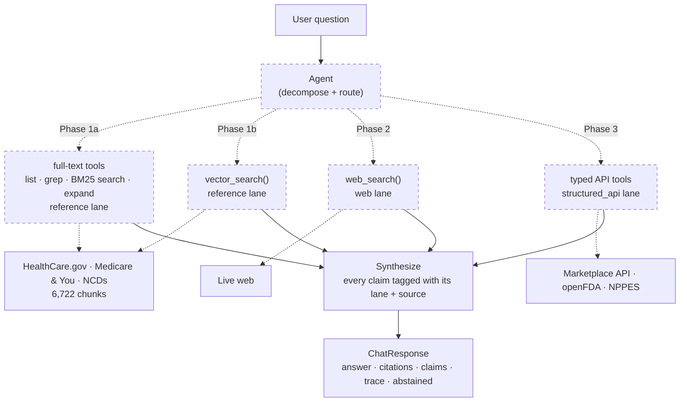
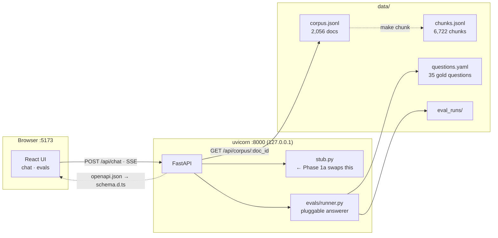
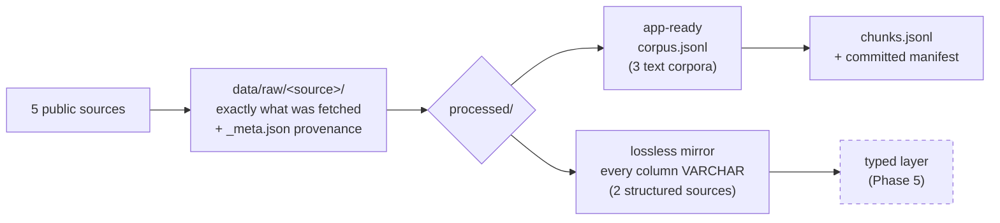
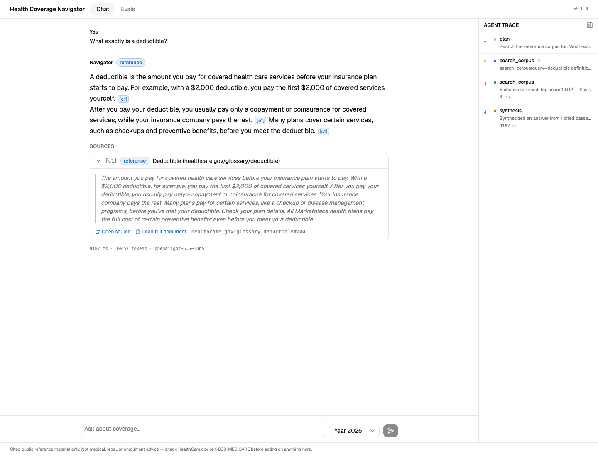

# Health Coverage Navigator

**An AI agent that answers U.S. health-insurance questions by routing each sub-question to the
right kind of source — indexed reference documents, deterministic public APIs, or the live web —
and shows you exactly what backs every claim.**

Built on public data only. Local-first. Eval-driven from the first commit.

---

## The engineering thesis

Most "chat with your documents" projects treat health coverage as a retrieval problem. It isn't.
Nearly every real question decomposes into sub-questions that need **fundamentally different
kinds of lookup**, and picking the wrong one produces an answer that is fluent, cited, and wrong.

| Sub-question type | Example | Lane | Why retrieval alone fails |
|---|---|---|---|
| *"What does the rule say?"* | What is a deductible? | **Reference** | — this is the one retrieval is for |
| *"What's the fact for this plan/drug/provider?"* | Is drug X covered under plan Y? | **Structured API** | The answer is a row in a database, not a passage. Retrieval will find a *plausible* passage. |
| *"What's happening now?"* | Any recent recall on drug X? | **Web search** | The corpus is a snapshot. It cannot know it is stale. |

So the core engineering problem is **tool routing**, and routing correctness is graded as its own
metric, separate from answer correctness. That framing drives everything else in the repo: the
API contract, the eval harness, and the phase order.

It also decides the shape of the build. This is **one agent that grows a toolset**, not a RAG app
that grows features: Phase 1 stands up a single PydanticAI agent over the reference corpus, and
every phase after it registers more tools on that same agent — vector search, then web search,
then typed API tools — rather than adding a pipeline beside it. Nothing anywhere chains
retrieve → stuff-context → generate; the agent chooses its own tools, and choosing is the thing
being graded.

Full reasoning: [docs/plan.md](docs/plan.md).

---

## Status — Phase 0 of 5 complete

> **Where this actually is:** the *entire skeleton* is built and runs end to end — data pipeline,
> eval harness, frozen API contract, FastAPI backend, React frontend — with a **stubbed answerer
> in place of the agent**. Phase 1a swaps that stub for a real PydanticAI agent. No LLM call
> happens anywhere in this repo yet, and nothing below overstates that.

This ordering is deliberate rather than incidental. The harness was built before the agent so the
agent has something to be measured against on the day it arrives, and the API contract was frozen
before there was anything real behind it so later phases add *values* to existing fields instead
of reshaping the response.

### What works today

| | |
|---|---|
| **Ingestion** | 5 bulk sources fetched, normalized, and committed — idempotent and re-runnable |
| **Corpus** | 2,056 documents across 3 text corpora → **6,722 chunks** with verified provenance |
| **Structured mirrors** | Exchange PUFs (3 tables, PY2026) + Medicare Part D SPUF (7 files, 2026Q2) as lossless columnar mirrors — *deliberately not chunked* |
| **Eval harness** | 35 gold questions (30 in-corpus + 5 abstention), recall@k / MRR / abstention accuracy, runs persisted as JSON, triggerable from the browser |
| **API** | FastAPI with a frozen contract: `POST /api/chat`, SSE streaming, eval endpoints, citation drill-down |
| **Frontend** | React 19 + Vite 8 + TS + Tailwind 4 + shadcn — chat page with source badges, expandable citation cards, collapsible agent-trace panel, abstention state, and an eval dashboard |
| **Type safety across the boundary** | TS types generated from FastAPI's OpenAPI schema — a Pydantic change becomes a compile error |
| **Guardrails** | `make scan` — a three-severity scanner for secrets, PII/PHI, and licence-restricted content, run before anything is published |
| **Configuration** | Secrets in a git-ignored `.env`; every non-secret in a **committed `config.yaml`** that no environment variable can override — so an eval score is reproducible from the repo |
| **Gates** | 84 Python tests + 11 Vitest, ruff, pyright, tsc, oxlint — all wired into one `make check-all` |

### What does not work yet

- **There is no agent.** `api/stub.py` returns canned responses. Phase 1a replaces it. `pydantic-ai`
  is installed and an API key is read from `.env`, but **nothing in this repo calls an LLM** —
  the dependency landing is not the capability landing.
- **No retrieval.** No BM25, no embeddings, no vector store. Phase 1a gives the agent a lexical
  toolset (list / grep / BM25 search / expand) with no database of any kind; 1b adds a LanceDB
  vector tool beside it.
- **No web search and no live API tools.** Phases 2 and 3.
- **Eval metrics are honestly terrible**, because they grade the stub: recall@5 = `0.033`,
  abstention accuracy = `0.40`. Every run record carries `runner: "stub"` and the dashboard
  renders it as a badge. These numbers are *real measurements of a placeholder*, not fabrications
  — which is exactly what makes them a usable baseline.

---

## Architecture

### The target system



*Dashed = not built yet. Today a stub sits where the agent will go, and `ChatResponse` — the solid
box — is already frozen and fully rendered by the UI. Each phase label is a set of tools added to
the same agent; the box marked `Agent` is never rebuilt after Phase 1a. Note that 1a and 1b both
point at the reference lane — they are two ways of searching one corpus, and 1b's vector tool
joins the lexical ones rather than replacing them.*

### What runs today



Vite proxies `/api` to uvicorn in development, so the browser only ever sees one origin —
**no CORS configuration anywhere**. In single-process mode FastAPI serves the built bundle itself.

### Ingestion



`processed/` deliberately means two different things, and the difference is load-bearing: a
structured source is **never** chunked or embedded. See [data/README.md](data/README.md).

---

## Screenshots

Both pages are live today. The amber banner across the top of each is the app declining to
overstate itself — *"Stub mode. Every answer is canned — no agent and no retrieval exist yet.
Eval runs are labelled `stub` for the same reason."* It disappears on its own at Phase 1a,
because it is driven by the same `stub` flag that labels the eval runs.

### Chat — the full provenance surface, rendering a canned answer



Everything the contract carries is already rendered: the **source badge** (`reference` — blue;
green and amber arrive with Phases 2 and 3), inline `[c1]`/`[c2]` markers that link to their
cards, **expandable citation cards** showing the retrieved snippet with a drill-down into the
real corpus document, and the **agent trace** with per-step timings and token counts. The two
citations have deliberately different shapes — one carries an external link and a retrieval
score, the other neither — so the components are proven against both branches rather than
against a convenient fixture. The plan-year selector sits beside the input and is sent on every
request, per the domain's most common correctness bug.

### Evals — genuine metrics, honestly labelled


`recall@5` of `0.033` and `3/35` passed is what grading a canned answerer *should* look like.
The numbers are really computed — the runner scores the stub's output against the gold set the
same way it will score the agent — and every run wears a `stub` badge so no future reader
mistakes the baseline for a result. Phase 1a swaps one function and these columns start meaning
something; the table, the storage format, and this page do not change. Below the runs sits the
gold set itself, with the `expected lane` column that Phase 2's routing-correctness metric will
be scored against.

---

## Quickstart

Requires [`uv`](https://docs.astral.sh/uv/) and **Node 22** (pinned in `.nvmrc`; the `ui-*` make
targets load nvm automatically if it is installed).

```bash
uv sync                 # Python deps into .venv
make ui-install         # frontend deps (needs node >= 22.12)
make dev                # both servers → open http://127.0.0.1:5173
```

The corpus is committed, so there is nothing to download. Ask anything — you'll get the stubbed
answer with two citations of deliberately different shapes and a four-step trace. Two trigger
words select the other canned variants:

- type **`abstain`** → the abstention state (a visually distinct panel, no citations)
- type **`lanes`** → a response exercising all three source badges at once

Everything else:

```bash
make chunk              # rebuild chunks.jsonl (git-ignored, ~1s)
make eval               # run the gold set → data/eval_runs/
make check-all          # ruff · pyright · pytest · tsc · oxlint · vitest
make types              # regenerate frontend/src/api/schema.d.ts from OpenAPI
make scan               # secrets / PII / licensing scan — run before publishing
make help               # everything
```

`make check-all` runs green on a fresh clone: the frontend gate *skips with a message* when
`frontend/node_modules` is absent rather than failing.

---

## Engineering decisions worth defending

Each of these is written up in full in `docs/`, including the alternatives that were rejected.

**1. The eval harness was built before the agent — and it grades the stub.**
`evals/runner.py` takes the answerer as a parameter. At Phase 0 that parameter is the chat stub,
so metrics are *genuinely computed against canned answers* rather than faked. Phase 1a swaps one
function; the API, the storage format, and the dashboard are untouched. A harness written after
the agent tends to be written to make the agent look good.

**2. `abstained` is a first-class boolean, not a phrase in the answer text.**
The grounding guardrail requires the agent to say *"not in my reference material"* rather than
hallucinate. If the frontend had to regex the answer to detect that, the guardrail would be one
prompt tweak away from breaking silently — in a health tool. So it is a field, and the UI renders
it as a distinct state. Same reasoning made the answer *structured* from day one
(`citations`, `claims`, `trace`, `source_type`) even in a phase with only one lane.

**3. The Pydantic ↔ TypeScript boundary is codegen, not discipline.**
`make types` dumps FastAPI's OpenAPI schema and generates `frontend/src/api/schema.d.ts`. Change
a model, and TypeScript errors on every component that no longer matches. TypeScript is pinned to
`~5.9` against the 6.x that `create-vite` now scaffolds, because `openapi-typescript` peer-requires
5.x — trading the enforcement mechanism for a major version nothing needs is the wrong trade.
The one seam codegen *can't* see (`client.ts` hand-writes its URL strings, so a renamed route
compiles clean and 404s at runtime) is why the [`sync-frontend`](.claude/skills/sync-frontend/SKILL.md)
skill exists.

**4. The licensing guardrail lives in code, with three severities.**
CPT and CDT procedure codes are AMA/ADA-copyrighted, so Medicare LCDs and Billing Articles are
blocked from this public repo while NCDs (which carry no procedure codes) are fine.
`scripts/scan_sensitive.py` enforces that alongside secrets and PII — **blocking** markers exit
non-zero, **advisory** ones compare against a recorded baseline so a *jump* is reported rather
than a nonzero, and **allowlisted** ones are suppressed but still counted. The advisory tier is
not a softer blocking tier; it exists because this corpus genuinely mentions CPT narratively in
revision histories, and a check that fails on legitimate mentions gets switched off within a week.
Licensing markers are scoped to `data/**` specifically so that **prose about the guardrail does
not trip the guardrail**.

The NCD fetcher makes the rule self-enforcing rather than policed: the MCD Coverage API's auth
boundary falls exactly on the licensing boundary — National endpoints answer without a key, LCD
and Article endpoints return `401` — so "NCDs only" becomes *the set of endpoints that respond
at all*.

**5. Chunk overlap is 320 characters because the longest gold snippet is 279.**
Not a round number picked by feel. Combined with snapping each chunk's start *backward only*,
realized overlap is always ≥ 320, so any passage shorter than that is wholly contained in at
least one chunk. That turns `test_gold_snippets_survive_chunking` from an observation into a
guarantee. "Snap to the nearest boundary" is the obvious-looking version of that code and quietly
breaks it — the splitter says so in a docstring.

**6. The Part D SPUF is fetched by HTTP range request.**
The published container is 2.49 GB of nested zips; the seven files this project needs total
9.4 MB. So the downloader reads the zip central directory over HTTP and pulls only the members it
wants — a 250× reduction in transfer cost on every refresh, which is the difference between a
pipeline that gets re-run and one that gets abandoned. What makes it trustworthy is the CRC32 in
the central directory: every member is verified before being written, so a mis-offset range fails
loudly instead of landing as plausible garbage.

**7. Structured sources land as a lossless mirror, not a model.**
Every column of the Exchange PUFs is stored as `VARCHAR`, byte-for-byte. Every "numeric" column
there is publisher-formatted text (`'$450 '`, `'70.88%'`, `'Not Applicable'` sitting beside an
empty field — and those two mean *different* things), and Plan Attributes carries **36
max-out-of-pocket columns**. Choosing which one is "the" MOOP needs real query requirements from
Phase 5. Guessing once at ingestion time is worse than not guessing.

---

## Built with Claude Code — the process, not just the output

This repo is also an experiment in **engineering the AI workflow itself**. The interesting part is
not that an LLM wrote code; it's the scaffolding that makes an LLM's output reviewable, consistent
across sessions, and safe to publish.

**Four documents, four jobs, no overlap.** The most common failure mode of AI-assisted work is
context that rots — a status line in a conventions file, design decisions buried in a changelog.
So the split is enforced:

| Doc | Answers | Never contains |
|---|---|---|
| [`docs/plan.md`](docs/plan.md) | *What to build, and when* | Completion status, frontend specifics |
| [`docs/frontend_plan.md`](docs/frontend_plan.md) | *How the web UI works* | Phase scheduling |
| [`docs/progress.md`](docs/progress.md) | *What is actually built* | Design rationale for unbuilt things |
| [`docs/glossary.md`](docs/glossary.md) | *What the words mean* | Schedule, design, or status |

**[`CLAUDE.md`](CLAUDE.md) holds only invariants** — the conventions that are true regardless of
how far along the build is. Guardrails stay legible because a status change never shows up in the
diff as a rules change.

**The progress log records dead ends, not just wins.** Every session appends *Did / Decided /
Rejected / Dead end / Stopped at*. A few of the entries that paid for themselves later:

- A test that monkeypatched a module constant but still wrote into the real `data/` tree, because
  default arguments bind at definition time. Caught by *listing the directory afterwards*, not by
  a failing assertion.
- `pyright` reported 0 errors for weeks while real type bugs sat in `tests/` — its `include` only
  covered `src`. A silent blind spot in the command the repo trusts is worse than a caught bug.
- 803 HealthCare.gov records collapsing to 747 distinct ids, because a Spanish content object
  self-reported an English URL. Deduping in the chunker would have silently stamped Spanish titles
  onto 21 English pages.

**Three custom skills encode procedures that are easy to get wrong**, in
[`.claude/skills/`](.claude/skills/):
[`scan-sensitive`](.claude/skills/scan-sensitive/SKILL.md) (the pre-publish guardrail),
[`sync-frontend`](.claude/skills/sync-frontend/SKILL.md) (propagate a contract change through
codegen — deliberately *not* about `make types`, which is one line, but about the seams codegen
cannot see), and [`wrap-up`](.claude/skills/wrap-up/SKILL.md) (close a session by updating
`progress.md`).

**A standing rule the assistant must obey: keep the glossary current.** Any change introducing a
domain term adds its entry in the *same* change — and an entry must say what the term means *in
this repo* (licensing status, routing lane, schema field, correctness rule), not just expand the
acronym.

---

## Repository map

```
health_coverage_navigator/
├── CLAUDE.md                     # invariants the assistant must obey
├── Makefile                      # every gate and workflow — `make help`
├── config.yaml                   # ⭐ every non-secret tunable — committed, never env-overridable
├── .env.example                  # secrets template; the real .env is git-ignored
├── src/health_coverage_navigator/
│   ├── api/
│   │   ├── models.py             # ⭐ the frozen HTTP contract
│   │   ├── app.py                # app factory, static mount, SPA fallback
│   │   ├── routes/               # health · chat · evals · corpus
│   │   └── stub.py               # canned responses ← Phase 1a replaces this
│   ├── chunking/                 # splitter · per-source strategies · pipeline
│   ├── evals/                    # gold-set models, loader, runner
│   └── config.py, settings.py, corpus.py, paths.py
├── frontend/src/
│   ├── api/{client,stream,schema.d.ts}   # schema.d.ts is GENERATED
│   ├── hooks/useChat.ts
│   ├── routes/{ChatPage,EvalsPage}.tsx
│   └── components/               # SourceBadge · CitationCard · TracePanel · …
├── scripts/                      # 5 downloaders + scan_sensitive.py
├── evals/gold/questions.yaml     # 35 hand-authored, corpus-verified questions
├── data/{raw,processed}/         # committed — see the licensing rules
└── docs/                         # plan · frontend_plan · progress · glossary + per-source guides
```

---

## Data sources & licensing

Everything here is public data, and the boundary is enforced rather than assumed.

**Vendored** (bulk, committed): HealthCare.gov consumer content (explicitly licensed for reuse) ·
Medicare & You and 82 other CMS publications (public domain) · Medicare Coverage Database
**NCDs only** · Health Insurance Exchange PUFs · Medicare Part D SPUF.

**Live only, never vendored**: NPPES NPI Registry and openFDA. Both publish bulk downloads; both
are per-record lookups, so a 4 GB mirror would buy staleness and storage in exchange for nothing.
The consequence is worth stating: **no provider-level data is ever vendored into this repo.**

**Blocked**: Medicare LCDs and Billing/Coding Articles (they embed AMA/ADA-copyrighted CPT/CDT
codes) · any proprietary code table · any PII, PHI, secret, or API key.

Details in [docs/plan.md](docs/plan.md), enforcement in
[`scripts/scan_sensitive.py`](scripts/scan_sensitive.py), definitions in
[docs/glossary.md](docs/glossary.md).

---

## Roadmap

| Phase | Backend | Frontend | Status |
|---|---|---|---|
| **0** | Corpus + eval scaffold | Contract frozen, UI on a stub | ✅ **Complete** |
| **1a** | The agent + a full-text toolset (no database) | Stub → real agent, streaming | ⏭️ **Next** |
| **1b** | `vector_search` (LanceDB) added alongside the lexical tools | Eval run-comparison view | ⬜ |
| **2** | Web-search tool (Tavily / Exa) + routing eval | `web` badge, routing accuracy | ⬜ |
| **3** | Typed API tools (Marketplace, openFDA, NPPES) | `structured_api` badge | ⬜ |
| **4** | Multi-step loop, per-claim provenance, tracing | Nested trace, claim highlighting | ⬜ |
| **5** | Plan comparison, drug costs, "what changed" monitor | Tables + monitor view | ⬜ |

The tri-modal core is complete at the end of Phase 3; everything after is additive. Each phase
pairs new capability with a new **eval slice** — retrieval quality → answer correctness and
groundedness → routing correctness → multi-hop correctness and citation accuracy → regression.

---

## Disclaimer

This is a personal engineering project. It is **not** medical, legal, insurance, or enrollment
advice. It presents cited public reference material and nothing more. Verify anything that
matters with the official source or a licensed professional.
